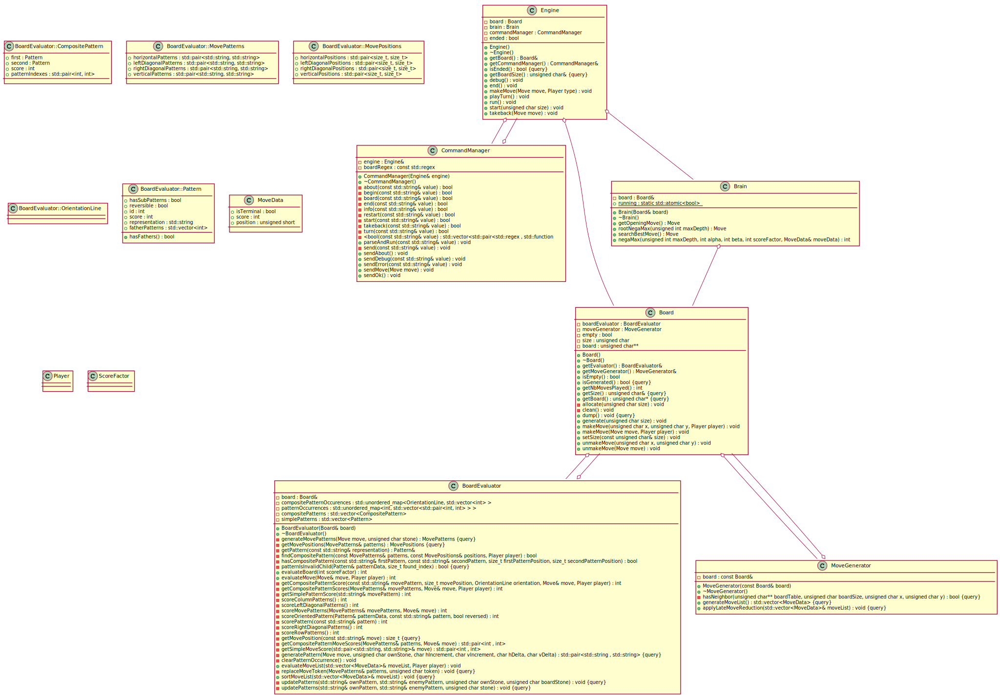

# The Gomoku Project, TenderFlow
Made by Buyumad Anas, Cler Gauthier and Dusautoir Vincent.

## What is Gomoku ?

**Gomoku**, also called Gobang or **Five in a Row**, is an abstract **strategy board game**.
It is traditionally played with **Go pieces** (black and white stones) on a **Go board**, using **15×15** of the **19×19** grid intersections.
Players alternate turns **placing** a **stone** of their **color** on an **empty intersection**. The **winner** is the first player to form an **unbroken chain of five stones** horizontally, vertically, or diagonally.

## What is this ?

This project has the simple **goal** of writing a **Gomoku AI Engine**, capable of **playing by itself** and defeat you ! It respects and utilizes many paradigms of **artifical intelligence** and **search algorithms**, all the while being compliant with the **Gomocup [protocol](http://petr.lastovicka.sweb.cz/protocl2en.htm)**.

## How to use it ?

In order to **use** our engine, you simply have to **build** the **executable** from the **sources** by typing the **following commands** in your **command shell**.

`cmake -G "Visual Studio 15 2017"`

`cmake --build . -- /p:Configuration=Release;OutDir="./"`

Once you have the **executable**, you can use it with **[Piskvork](http://gomocup.org/piskvork/)**, the **Gomocup official GUI**, in order to **play** against it or setup **tournaments**.

## How does it work ?

The engine is divided in **three distinct parts**.
First, we have the **engine**, linked to a **command manager**, it **controls the flow** of the program and **executes** the **requested commands**.
Second, we have the **board**, which is a simple **representation** of the **game state**, **interfacing** the different **manipulations** we need to make.
Finally, we have the **brain**, which is the **core** of the program, and is how our engine **thinks** and **plays**.

We have implemented a list of algorithms and implementations, as follows.

### Moves

The moves (X, Y) are **encoded** in a **short integer**, in order to **reduce** the amount of **memory access**.

---

### [Negamax](https://en.wikipedia.org/wiki/Negamax)

A **search algorithm** that relies on the **zero-sum property** of a **two-player game**.
It is a variant of the famous **[minimax](https://en.wikipedia.org/wiki/Minimax)** algorithm and in order to **simplify** its implementation, relies on the fact that **max(a, b) = -min(-a, -b)**.

---

### [Iterative Deepening](https://en.wikipedia.org/wiki/Iterative_deepening_depth-first_search)

A **search strategy** that implements a **depth limit** on the **Minimax** algorithm. This effectively permits to acquire results **quickly**, improving through **time** as the **depth limit is increased**. It is notably effecient when there is a **time restriction** for the engine to play.

---

### [Alpha-Beta Pruning](https://en.wikipedia.org/wiki/Alpha%E2%80%93beta_pruning)

A **search algorithm** that seeks to **decrease the number of evaluated nodes** by the minimax algorithm. It stops completely evaluating a move when at least one possibility has been found that proves the **move to be worse than a previously examined move**. Such moves need not be evaluated further.

---

### Pattern Matching

In order to **evaluate** the **score** of a **move** and **board state**, we rely on **pattern-matching**. Which is the act of **checking** a given **sequence of tokens** for the presence of some **pattern**. Which can for example be 4 stones aligned on the same row.

---

### Smart Move Generation

When **generating possible moves**, we use a **heuristic** based on the **relative distance** to the stones already placed on the board. It is natural and easy to prove that a move **far away** from the battle has a high probability of being **inadequate**.

---

###  [Move Ordering](https://chessprogramming.wikispaces.com/Move+Ordering?responseToken=0824105ddb818490cfb56336ab704bba5)

In order to **improve** the efficiency of the **Alpha-Beta** algorithm, it is essential to search the **best moves first**. That's why we **sort** our moves based on a **heuristic** (namely the **pattern-matching evaluation**) in order to improve the **cutoffs**.

---

### [Late Move Pruning](https://chessprogramming.wikispaces.com/Late+Move+Reductions)

In order to **improve** the efficiency of the **Minimax** algorithm, it is essential to only search **valuable moves**, that's why we **prune** what is known as **late moves**, so that we won't **waste time** examining poor moves. This improvement is also known as **beam search**.

## UML

